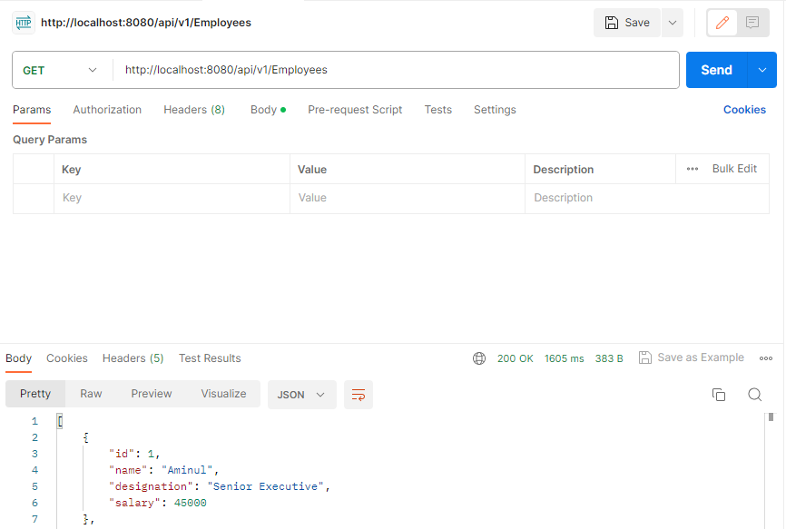

# @ResponseBody

The `@RequestBody` annotation tells the Controller that the object returned is automatically serialized in JSON and passed back to the HttpResponse object.

Spring has a list of `HttpMessageConverters` registered in the background. The responsibility of the `HTTPMessageConverter` is to convert the request body to a specific class and back to the response body again, depending on a predefined mime type. Every time an issued request hits `@ResponseBody`, Spring loops through all registered `HTTPMessageConverters` seeking the first that fits the given mime type and class and then uses it for the actual conversion.

```java
	public Employee(long id,String name, String designation, int salary) {
		super();
		this.id=id;
		this.name = name;
		this.designation = designation;
		this.salary = salary;
	}
```
**Response Body:**  

```json
    {
        "id": 1,
        "name": "Aminul",
        "designation": "Senior Executive",
        "salary": 45000
    }
```
**Postman View:**

