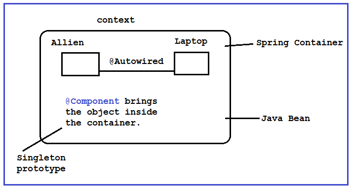

# Component
In below code snippet, `context` is a spring container. The class Allien is not inside the context container. The Java Bean is pointing to that Spring Container. So when getBean() is called then it doesn't find any object called `allien` inside the container. That's why showing error while running the app.
```java
@SpringBootApplication
public class DemoApplication {

	public static void main(String[] args) {
		ConfigurableApplicationContext context= SpringApplication.run(DemoApplication.class, args);
		
		Allien a= context.getBean(Allien.class);
		a.show();
	}

}

public class Allien {
	private int id;
	private String name;
	private String tech;
	public int getId() {
		return id;
	}
	public void setId(int id) {
		this.id = id;
	}
	public String getName() {
		return name;
	}
	public void setName(String name) {
		this.name = name;
	}
	public String getTech() {
		return tech;
	}
	public void setTech(String tech) {
		this.tech = tech;
	}
	
	public void show() {
		System.out.println("Allien");
	}

}
```

To solve this problem, you can use `@Component` which will bring the object inside the Spring Container.

```java
import org.springframework.boot.SpringApplication;
import org.springframework.boot.autoconfigure.SpringBootApplication;
import org.springframework.context.ConfigurableApplicationContext;

@SpringBootApplication
public class DemoApplication {

	public static void main(String[] args) {
		ConfigurableApplicationContext context= SpringApplication.run(DemoApplication.class, args);
		
		Allien a= context.getBean(Allien.class);
		a.show();	//Allien
	}

}

import org.springframework.stereotype.Component;

@Component
public class Allien {
	private int id;
	private String name;
	private String tech;
	public int getId() {
		return id;
	}
	public void setId(int id) {
		this.id = id;
	}
	public String getName() {
		return name;
	}
	public void setName(String name) {
		this.name = name;
	}
	public String getTech() {
		return tech;
	}
	public void setTech(String tech) {
		this.tech = tech;
	}
	
	public void show() {
		System.out.println("Allien");
	}

}

```
The constructor of Allien class is called by default even if you don't create any instance of it. As soon as the application run the object is created by default.  
If you instantiate the class multiple times, still the constructor will be invoked once. As, Spring Boot is using the singleton design patter concept. In singleton you will get only one instance.  

If you use `@Scope(value="prototype")` then system will be using the prototype. Means, no object will be created by default. So object will be created depending on number of instance.

```java
import org.springframework.stereotype.Component;
import org.springframework.context.annotation.Scope;

@Component
@Scope(value="prototype")
public class Allien {
	private int id;
	private String name;
	private String tech;
	
	Allien(){
		System.out.println("Allien constructor");
	}
}
```
# Autowired

In below code, the `@Component` keyword brings both the class `Allien` and `Laptop` inside the context container. But none of them can access the properties of each other. So, to build the relationship between them `@Autowired` is being used.

```java
import org.springframework.stereotype.Component;

@Component
public class Laptop {
	public void compile() {
		System.out.println("Compiling.....");
	}

}

import org.springframework.stereotype.Component;
import org.springframework.context.annotation.Scope;
import org.springframework.beans.factory.annotation.Autowired;

@Component

public class Allien {
	private int id;
	private String name;
	private String tech;
	@Autowired
	private Laptop laptop;

    	public void show() {
		System.out.println("Allien");
		laptop.compile();
	}

}
```

